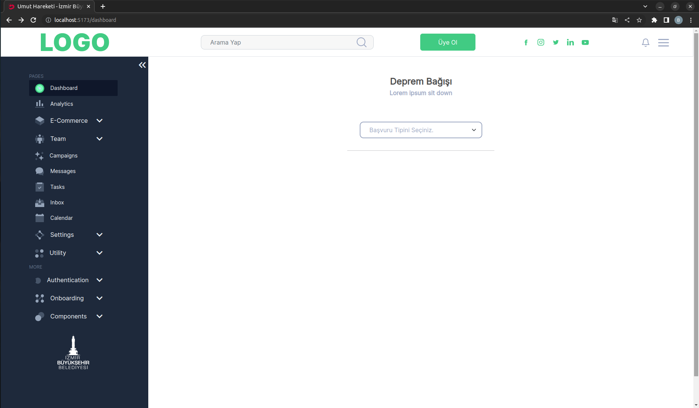
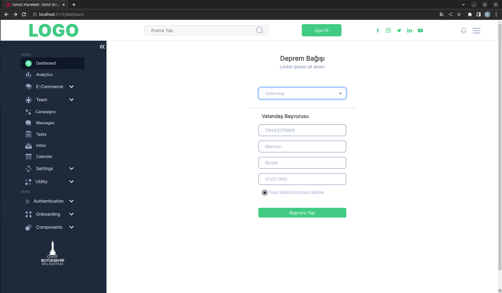
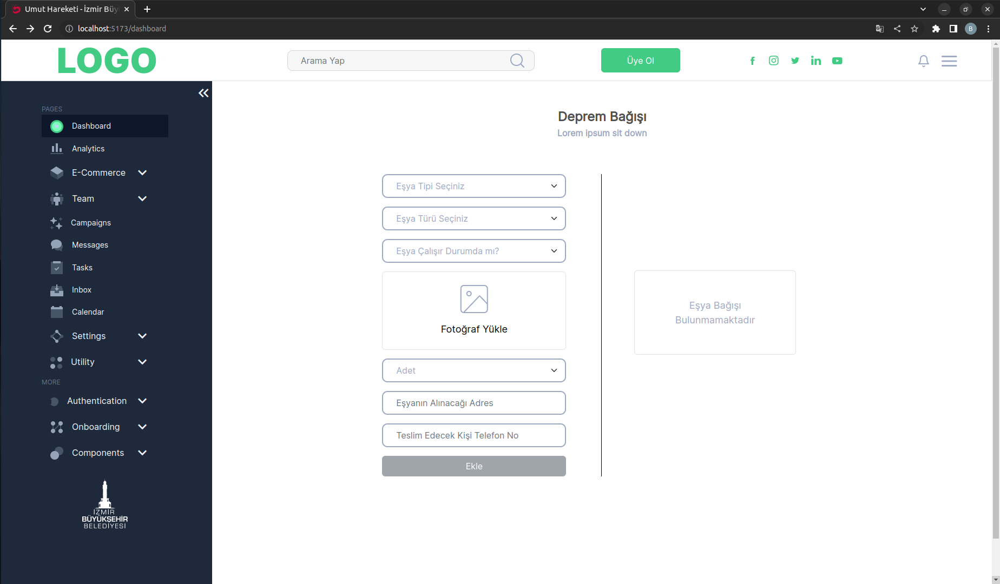
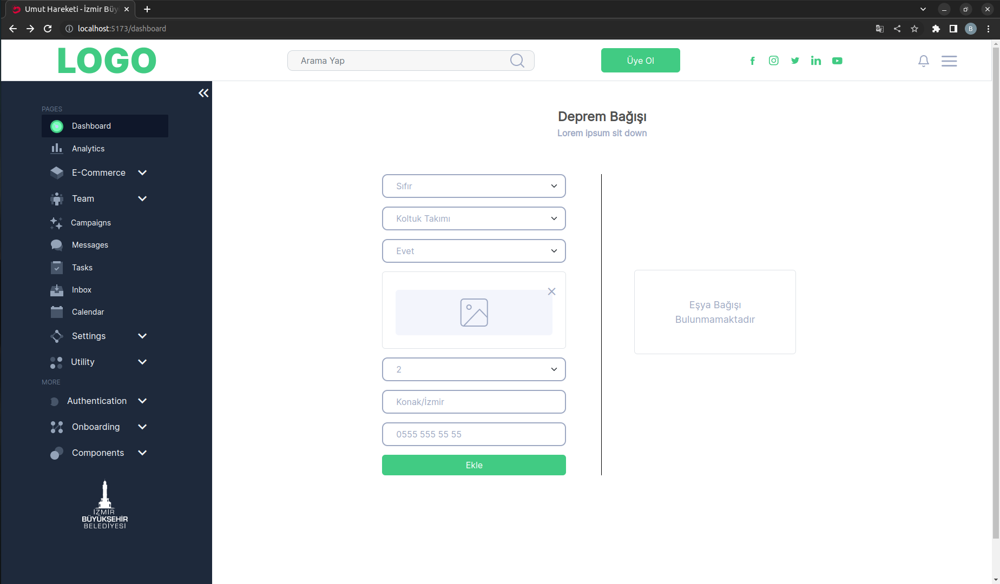
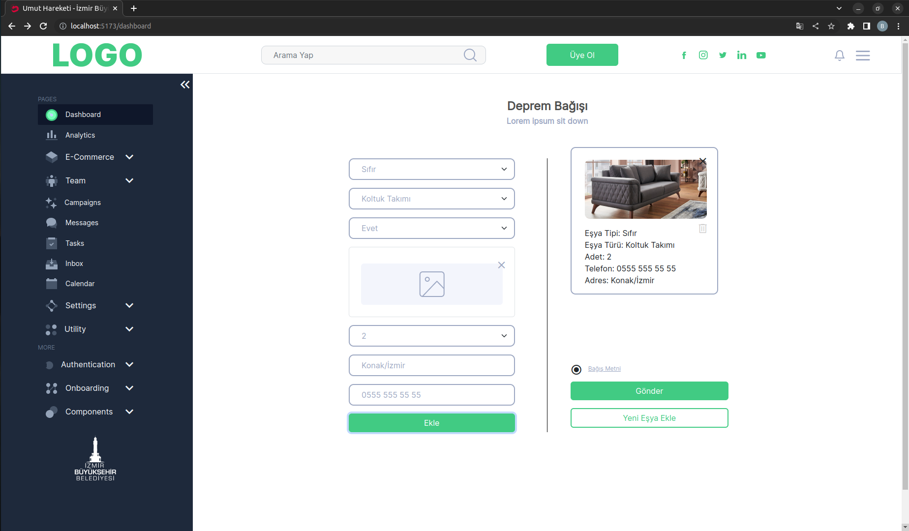
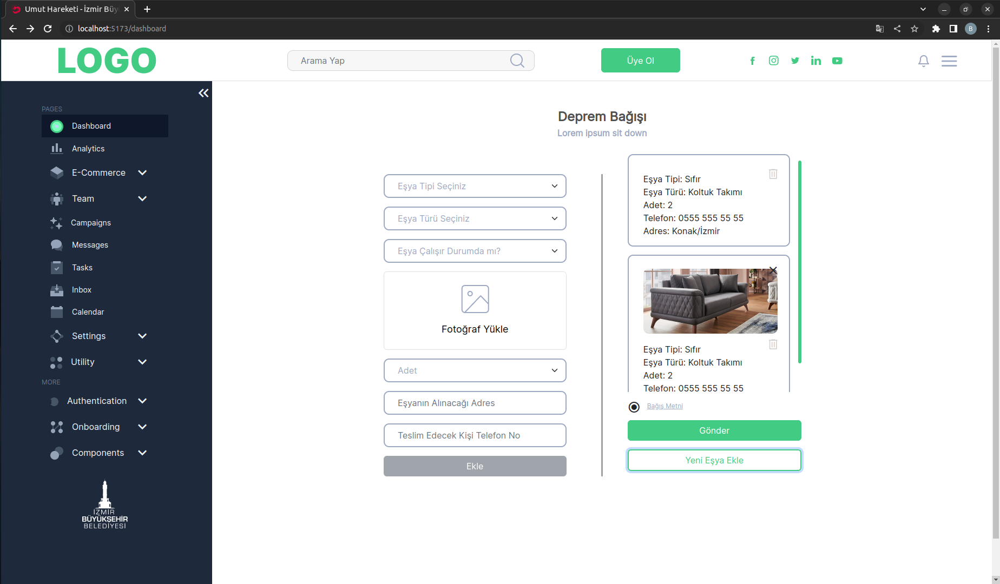

# TestCaseBegumKucuk
Test Case for Frontend
This project was created by using Vue3 and Typescript. To use the buttons & form inputs & navigation bar, bootstrap was used.
Pages below are the demonstration example of the project.

